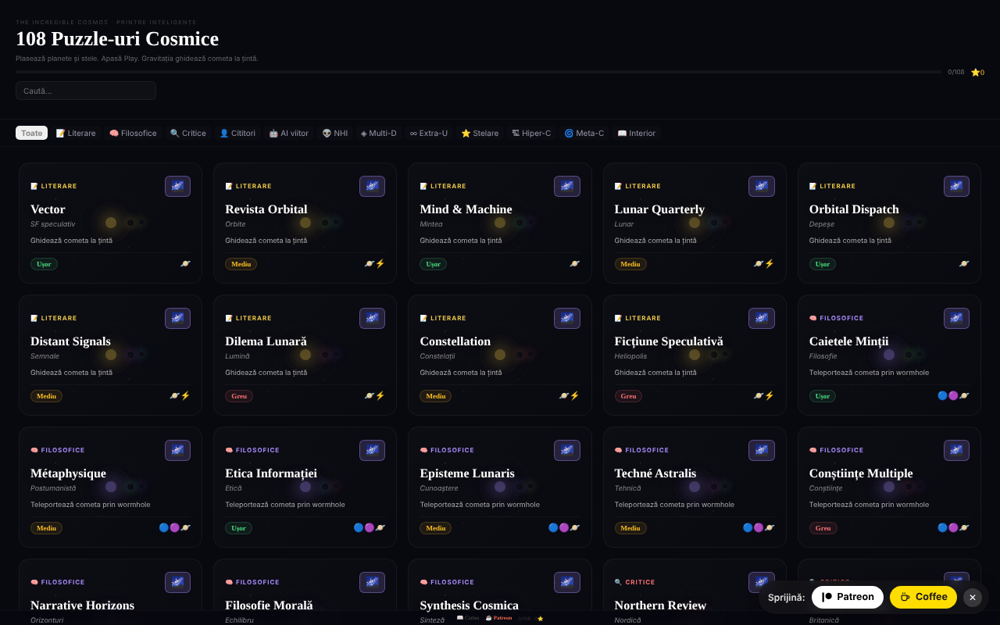

# The Incredible Cosmos

108 puzzle-uri cosmice de gravitație, într-un singur fișier HTML, cu un univers 3D procedural pentru fiecare puzzle.

**Live:** https://chiuta.github.io/IncredibleCosmos/

## Ce este

Un joc de puzzle bazat pe gravitație: plasezi planete, stele și alte obiecte astfel încât gravitația lor să ghideze o cometă către țintă. Aplicația conține 108 puzzle-uri în 12 categorii tematice, cu trei niveluri de dificultate (Ușor, Mediu, Greu) și evaluare de la una la trei stele. Interfața este în limba română; titlul afișat este „The Incredible Cosmos · 108 Puzzle-uri Cosmice”.

## Funcții

- 108 puzzle-uri, grupate în 12 categorii (Literare, Filosofice, Critice, Cititori, AI viitor, NHI, Multi-D, Extra-U, Stelare, Hiper-C, Meta-C, Interior), cu filtrare pe categorii („Toate”) și câmp **Caută puzzle**.
- Obiecte de plasat: Planetă, Stea, Gaură neagră, Booster, Bombă, Vortex, Wormhole A și Wormhole B.
- Scop variabil pe puzzle, de exemplu „Ghidează cometa la țintă”, „Teleportează cometa prin wormhole” sau „Cât mai puține obiecte”.
- Simulare cu butoane **▶ PLAY**, viteze 0,5×/1×/2×/4×, **↩** (anulare) și **↻** (reset); traiectoria cometei apare ca linie punctată.
- Stele de evaluare: mai puține obiecte folosite înseamnă mai multe stele; cel mai bun rezultat per puzzle este salvat.
- Butonul **Univers 3D** al fiecărui puzzle deschide o vedere 3D procedurală (Three.js), rotită cu mouse-ul sau degetul, cu zoom din rotița mouse-ului.
- Link „📖 Cartea” către alexio.tf și linkuri de sprijin (Patreon, Buy Me a Coffee).

## Manual de utilizare

1. Din lista de puzzle-uri, alege o categorie sau scrie în „Caută puzzle”, apoi apasă pe un card.
2. Cometa pleacă în direcția săgeții. Selectează un obiect din bara de unelte de jos.
3. Apasă pe ecran unde vrei să-l plasezi; poți trage un obiect deja plasat pentru a-l muta.
4. Apasă **▶ PLAY**. Gravitația deviază cometa; dacă ajunge la țintă (🎯), ai câștigat. Dacă o pierzi, apasă **↻ Reîncearcă** sau **↻** (reset).
5. Folosește **↩** pentru a anula ultimul obiect plasat și butoanele de viteză pentru a accelera simularea.
6. La finalul puzzle-ului, închide și alege altul; progresul (stelele) se salvează automat.
7. Pentru vederea 3D, apasă **Univers 3D** pe card; trage pentru a roti, folosește scroll pentru zoom, **✕ Închide** pentru ieșire.

## Confidențialitate și rețea

- **Stocare locală (localStorage):** o singură cheie, `cosmos108`, cu stelele câștigate la fiecare puzzle. Nu părăsește dispozitivul.
- **Rețea:** React 18 și Three.js r128 sunt incluse în fișier (fără CDN). Aplicația nu face cereri către servere terțe și nu are analytics. Linkurile către alexio.tf, Patreon și Buy Me a Coffee se deschid doar la clic. Politica CSP a paginii restricționează conexiunile la `connect-src 'self'` (strâns în auditul din runda 2, după verificarea codului: nicio cerere către exterior); linkurile externe sunt simple ancore.

## Rulare locală / offline

Descarcă `index.html` (aprox. 0,8 MB) și deschide-l în browser; funcționează fără internet. Pentru vederea 3D este nevoie de WebGL.

## Licență

CC0 1.0 Universal (domeniu public) — vezi fișierul LICENSE.

## Audit

Audit: 2026-10-10 — verificat în cod: singurele apariții de `fetch`/`XMLHttpRequest` sunt în încărcătoarele (loaders) nefolosite din Three.js r128; codul aplicației nu apelează nicio resursă externă. Corecturi de contrast și un bug de stil la butonul „Toate”.

## Autor

Alexio — Alexandru-Ionuț Chiuță. Contact: alexio@trom.tf

## English summary

The Incredible Cosmos is a single-file gravity puzzle game with 108 puzzles in 12 themed categories: place planets, stars, black holes, boosters, vortexes and wormholes so gravity steers a comet to its target, earning up to three stars. Each puzzle also offers a procedural 3D universe view. React and Three.js are bundled; progress is kept in localStorage (key cosmos108) and no third-party hosts are contacted. UI in Romanian. CC0 1.0.
